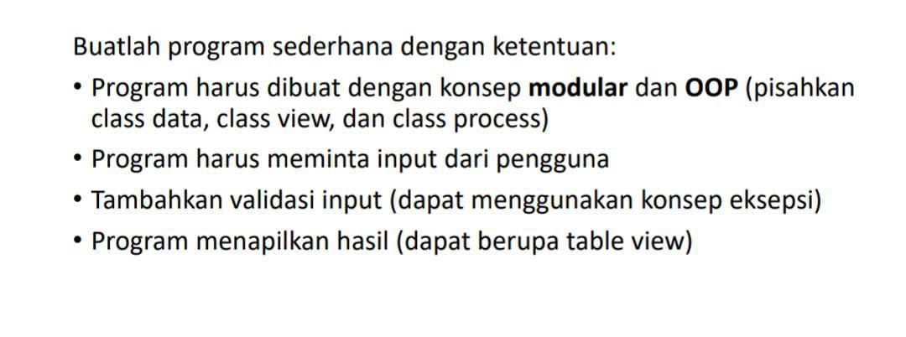
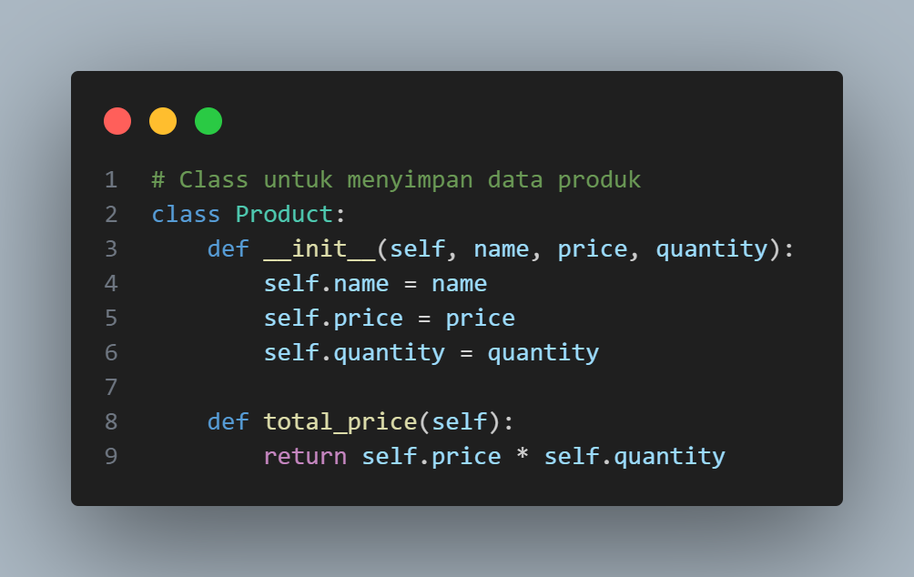
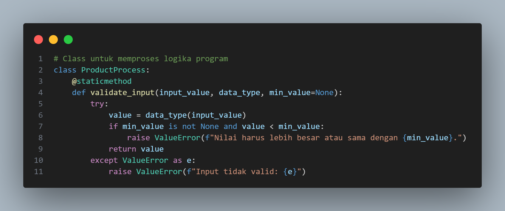
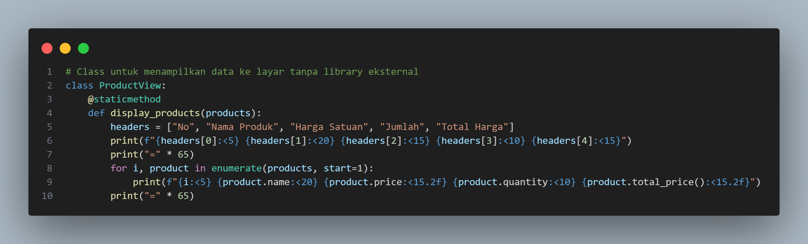
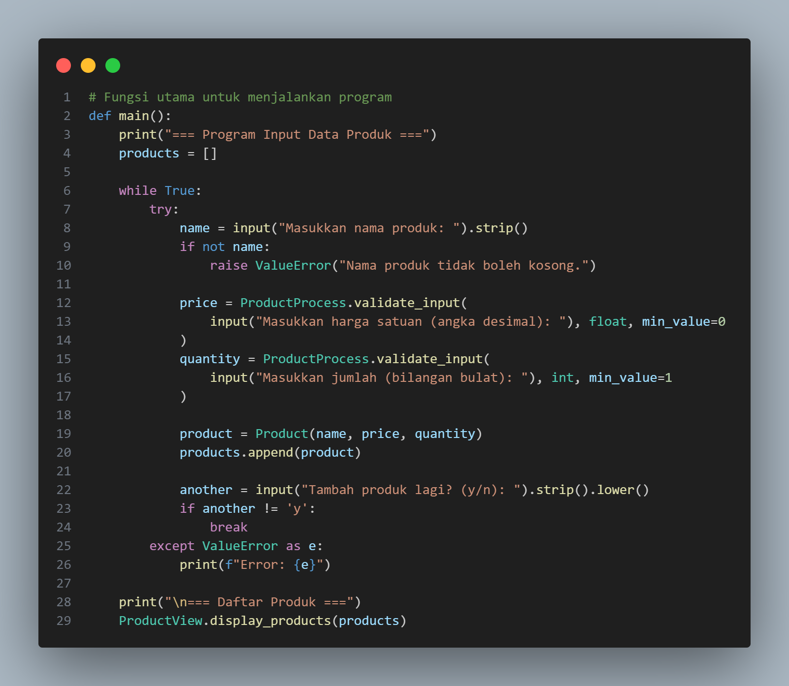
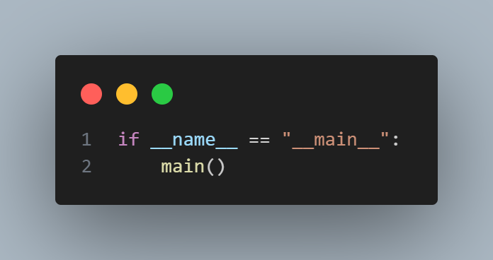
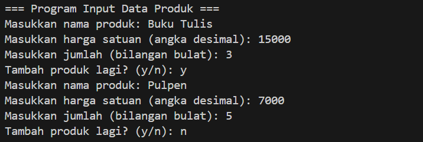
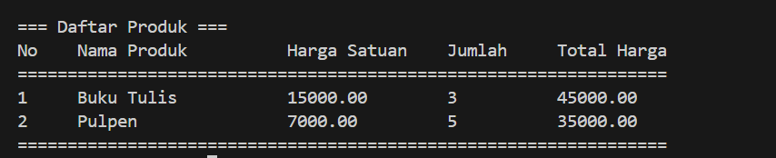

# PROJECT UAS BAHASA PEMROGRAMAN

## Step 1 : Class Product (Menyimpan Data Produk)

Penjelasan:
Class Product digunakan untuk menyimpan data produk.
Atribut yang dimiliki:
* name (nama produk).
* price (harga satuan produk, dalam bentuk float).
* quantity (jumlah produk, dalam bentuk integer).
Metode:
* total_price(): Menghitung total harga produk (price * quantity).

## Step 2 : Class ProductProcess (Validasi Input Pengguna)

Penjelasan:
Class ini bertugas untuk memvalidasi input yang dimasukkan oleh pengguna.
Metode validate_input:
* Menerima input_value (nilai yang dimasukkan pengguna), data_type (tipe data seperti float atau int), dan  min_value (nilai minimum, jika ada).
* Mencoba mengubah input menjadi tipe data yang diinginkan.
* Jika input tidak valid (misalnya harga negatif atau teks dimasukkan untuk harga), program akan memberikan pesan error.

## Step 3 : Class ProductView (Menampilkan Data dalam Tabel)

Penjelasan:
Class ini bertanggung jawab untuk menampilkan data produk dalam bentuk tabel sederhana.
Proses Menampilkan Tabel:
* Header tabel didefinisikan di headers.
* Setiap produk ditampilkan dalam bentuk baris tabel dengan format tertentu.
* Kolom disesuaikan dengan lebar tertentu (:<width>), misalnya <20 artinya lebar kolom 20 karakter.
* Garis pemisah menggunakan karakter =.

## Step 4 : Fungsi main (Fungsi Utama Program)

Penjelasan:
Fungsi main bertanggung jawab untuk menjalankan keseluruhan program.
Proses kerja:
1. Inisialisasi List Produk:
    * List kosong products dibuat untuk menyimpan semua data produk.
2. Input Pengguna:
    * Nama produk diminta dari pengguna.
    * Harga produk dan jumlah divalidasi menggunakan ProductProcess.validate_input.
    * Jika valid, data dimasukkan ke dalam list products.
3. Pengulangan:
    * Setelah memasukkan satu produk, pengguna ditanya apakah ingin menambah produk lagi (y/n).
    * Jika pengguna menjawab selain y, pengulangan berhenti.
Menampilkan Data:
    * Semua data produk ditampilkan dalam bentuk tabel menggunakan ProductView.display_products.

## Step 5 : Bagian if __name__ == "__main__":

Penjelasan:
* Bagian ini memastikan bahwa fungsi main hanya akan dijalankan jika file ini dijalankan langsung, bukan  diimpor ke file lain.

## CONTOH JALANNYA PROGRAM

Input Pengguna :

## OUTPUT :

# KESIMPULAN :

